# Multi-Tenant AI-Powered E-commerce


Enterprise-grade AI-powered ecommerce platform designed for intelligent customer engagement, conversational shopping experiences, AI-assisted commerce workflows, and scalable multi-tenant storefront operations.

---

## Platform Vision

SHIVAM ITCS introduces a next-generation multi-tenant AI commerce ecosystem engineered for intelligent customer engagement, conversational shopping experiences, and scalable storefront operations.

The platform combines conversational AI, voice-assisted interactions, image-based product discovery, personalized recommendations, and modern commerce workflows into a unified digital commerce infrastructure.

Designed with a product-engineering mindset, the ecosystem focuses on scalability, seamless customer interaction, AI-assisted product discovery, and high-performance multi-tenant commerce experiences for modern businesses.

---

## Platform Highlights

- Multi-tenant commerce architecture
- AI-powered shopping assistant
- Conversational commerce workflows
- Voice-powered shopping experience
- Intelligent image-based product search
- AI-assisted add-to-cart workflows
- AI-powered checkout experience
- Personalized recommendation system
- Mobile-first commerce experience
- Real-time analytics dashboards
- Scalable storefront infrastructure
- Enterprise-grade UI architecture

---

## AI Commerce Infrastructure

### Intelligent AI Shopping Assistant

The platform includes an AI-powered commerce assistant designed for conversational shopping experiences and intelligent customer engagement.

Customers can:
- interact using conversational AI chat
- perform voice-powered shopping
- search products using images
- receive contextual recommendations
- add products directly to cart through AI interactions
- complete intelligent checkout workflows

The AI assistant understands customer intent, shopping preferences, and contextual buying behavior to deliver personalized and seamless commerce experiences.

---

### Conversational Commerce Features

- AI chat-based shopping assistance
- Voice-enabled commerce interactions
- Intelligent image-based product search
- Context-aware product recommendations
- Smart cart management
- AI-assisted checkout workflows
- Personalized shopping journeys
- Real-time customer engagement

---

### AI-Powered Product Discovery

The platform enables customers to discover products through multiple intelligent interaction methods:

- text-based conversational search
- voice-driven shopping workflows
- image-based product recognition
- contextual recommendation pipelines
- smart filtering infrastructure

This creates a faster, more intuitive, and highly personalized shopping experience across web and mobile commerce environments.

---

## Mobile Commerce Experience

The platform includes an AI-powered mobile commerce application designed to deliver seamless shopping experiences across modern mobile devices.

Customers can:
- explore products with intelligent filters
- interact with AI shopping assistants
- use voice-powered search workflows
- receive personalized recommendations
- manage orders and accounts
- experience optimized mobile checkout flows

The mobile ecosystem is engineered for high-performance commerce interactions, responsive navigation, and intelligent customer engagement.

---

## Multi-Tenant Architecture

- Tenant-based storefront isolation
- Shared commerce infrastructure
- Scalable business onboarding
- Centralized operational management
- Store configuration management
- Independent storefront experiences

---

## Enterprise Features

- Responsive storefront architecture
- AI-driven customer engagement
- Modern ecommerce UI system
- Intelligent recommendation workflows
- Optimized rendering pipelines
- Enterprise analytics dashboards
- Scalable commerce infrastructure
- Mobile-optimized shopping experience
- AI-powered mobile search workflows
- Secure checkout experience

---

## Technology Stack

### Frontend Engineering
- React
- Next.js
- Tailwind CSS
- shadcn/ui
- Radix UI
- Framer Motion
- Lucide Icons
- Google Font API

---

## Security Architecture

- Tenant-level isolation
- Secure authentication workflows
- Protected commerce APIs
- Role-based dashboard access

---

## Scalability Engineering

- Modular frontend architecture
- Optimized rendering pipelines
- Multi-tenant infrastructure
- High-performance commerce interactions

---

## Performance Optimization

- Turbopack optimization
- Asset optimization
- Lazy loading strategies
- Optimized mobile rendering
- Priority Hints integration

---

## AI Infrastructure

- Conversational commerce engine
- AI recommendation workflows
- Voice interaction processing
- Image-based product discovery

---

### Performance & Infrastructure
- Turbopack
- Nginx
- Priority Hints
- Optimized asset delivery
- High-performance rendering pipelines

---

## System Architecture

```txt
┌────────────────────────────────────┐
│        Web & Mobile Clients        │
│ Next.js + AI Mobile Commerce App   │
└────────────────┬───────────────────┘
                 │
                 ▼
┌────────────────────────────────────┐
│      AI Commerce Interaction       │
│ Intelligent Sales Assistant Layer  │
└────────────────┬───────────────────┘
                 │
                 ▼
┌────────────────────────────────────┐
│     Multi-Tenant Commerce Core     │
│ Tenant Isolation + Store Logic     │
└────────────────┬───────────────────┘
                 │
                 ▼
┌────────────────────────────────────┐
│    Product & Commerce Services     │
│ Recommendations + Analytics        │
└────────────────────────────────────┘
```

---

## Platform Preview

Modern AI-powered commerce experiences designed for intelligent customer engagement, conversational shopping workflows, and scalable enterprise storefront operations.

---

# 🌐 Web Platform Screenshots

---

### 🤖 AI Shopping Assistant

<p align="center">
  
</p>

---

### 🏬 Premium Storefront

<p align="center">
  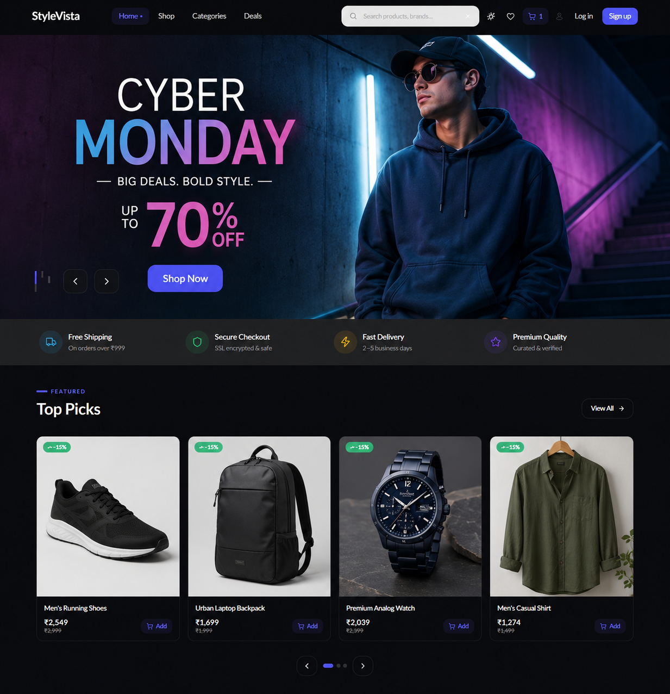
</p>

---

### 🛍️ Product Discovery Experience

<p align="center">
  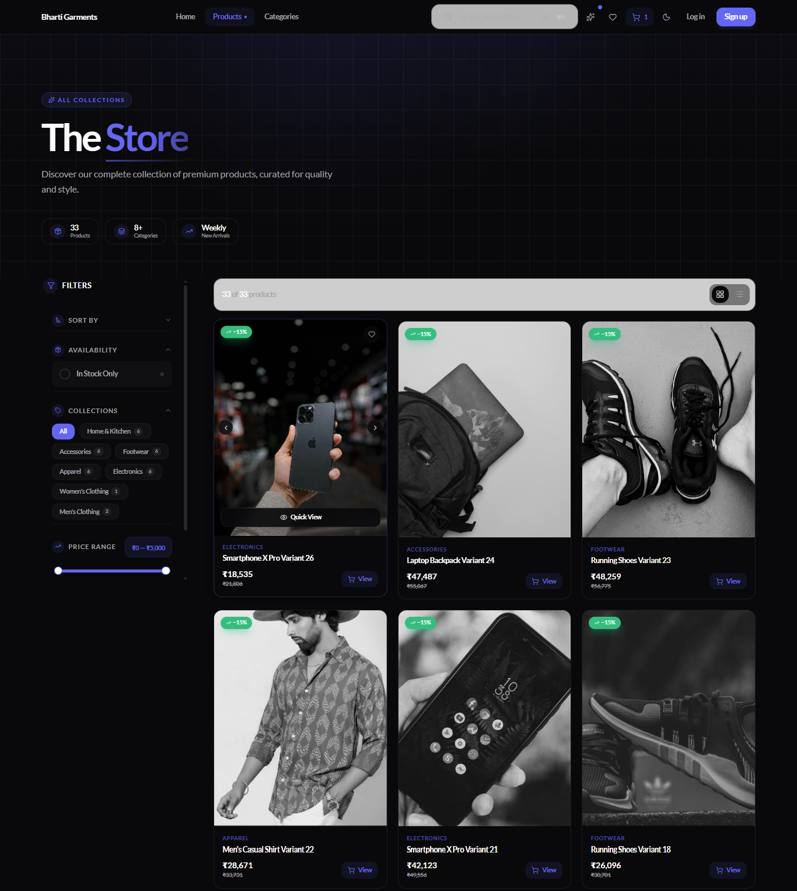
</p>

---

### 📦 Product Details & Recommendations

<p align="center">
  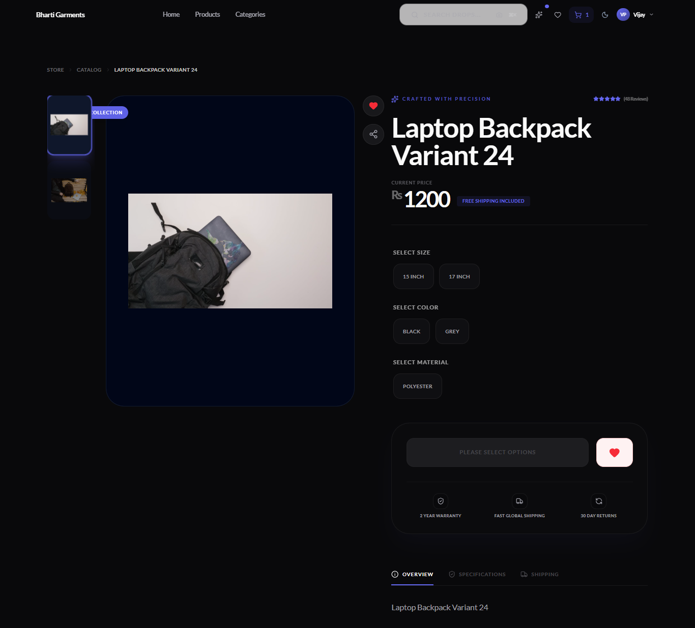
</p>

---

### 🎯 Category Discovery

<p align="center">
  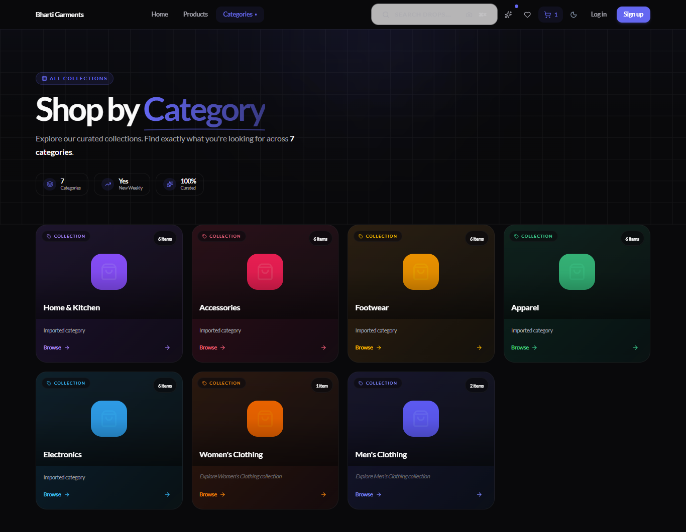
</p>

---

### 🛒 Shopping Cart Experience

<p align="center">
  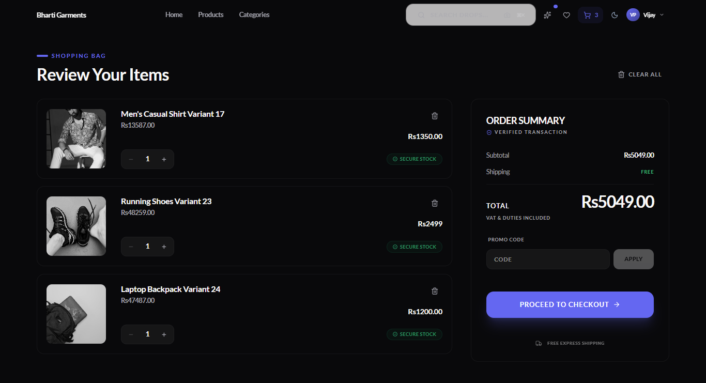
</p>

---

### 📊 Merchant Analytics Dashboard

<p align="center">
  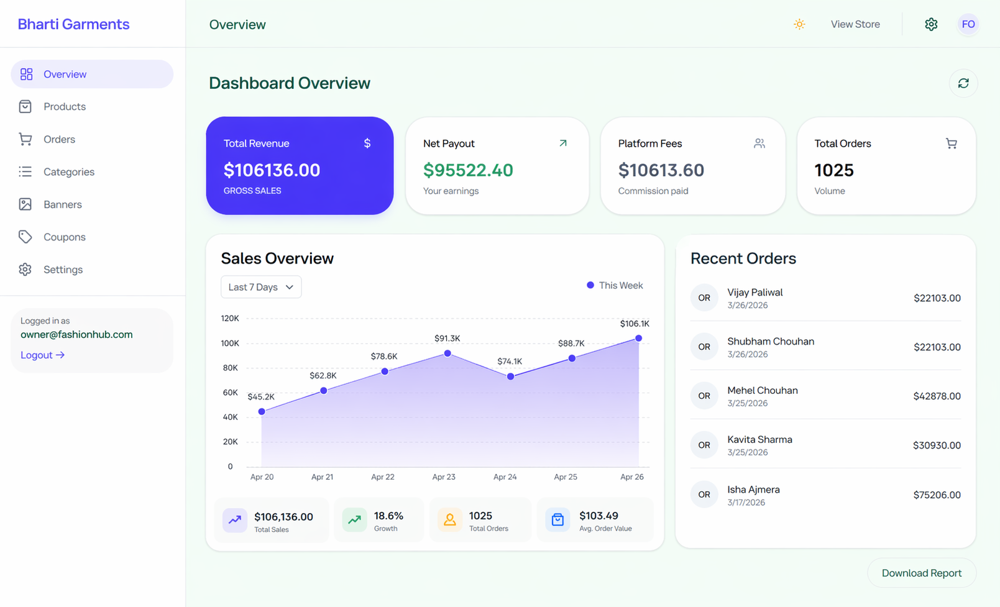
</p>

---

### 🏢 Multi-Tenant Management

<p align="center">
  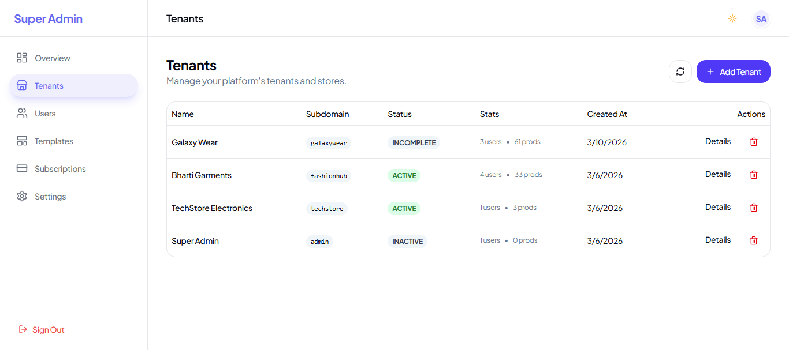
</p>

---

### ⚙️ Store Configuration

<p align="center">
  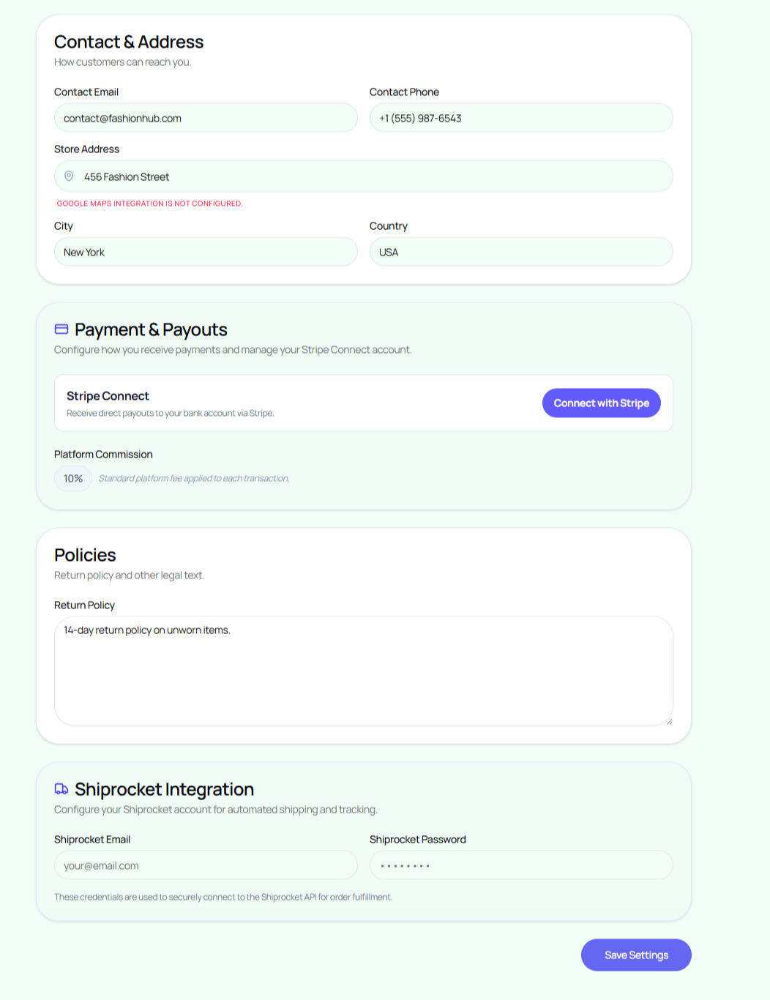
</p>

---

# 📱 Mobile App Screenshots

Modern mobile commerce experience engineered for intelligent shopping workflows, AI-assisted interactions, and seamless customer engagement.

---

<table align="center">
<tr>
<td align="center">
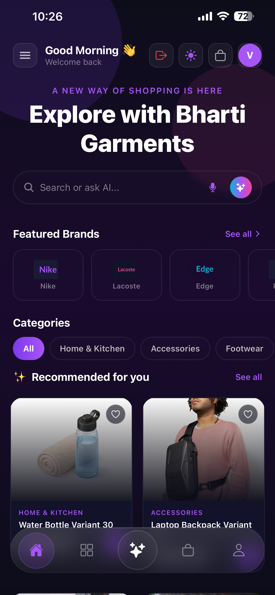
<br/>
<b>🏠 Home Screen</b>
</td>

<td align="center">
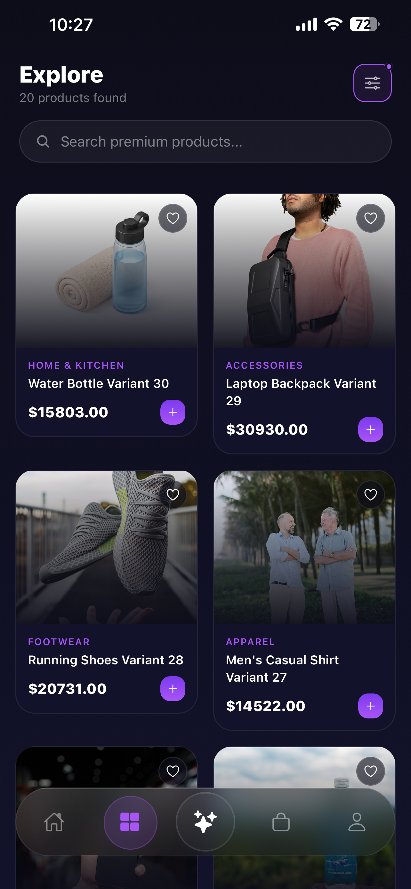
<br/>
<b>🔍 Explore Products</b>
</td>

<td align="center">

<br/>
<b>🛍️ Product Details</b>
</td>
</tr>
</table>

---

<table align="center">
<tr>
<td align="center">

<br/>
<b>🎛️ Smart Product Filters</b>
</td>

<td align="center">
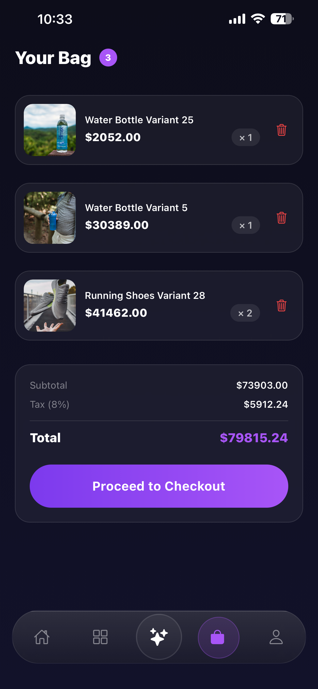
<br/>
<b>🛒 Shopping Cart</b>
</td>

<td align="center">

<br/>
<b>💳 Checkout Experience</b>
</td>
</tr>
</table>

---

<table align="center">
<tr>
<td align="center">
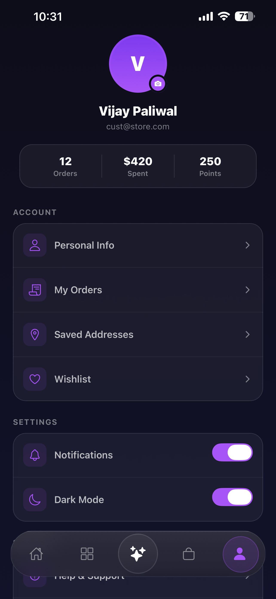
<br/>
<b>👤 User Profile</b>
</td>

<td align="center">

<br/>
<b>📦 Order History</b>
</td>
</tr>
</table>

---

---

## Business Problem

Traditional ecommerce platforms often struggle with:
- generic shopping experiences
- disconnected customer engagement
- poor personalization workflows
- inefficient product discovery
- low conversational interaction
- limited intelligent commerce capabilities

Modern businesses require AI-driven commerce ecosystems capable of delivering intelligent customer experiences, scalable storefront operations, and personalized digital shopping journeys.

---

## Solution

The Multi-Tenant AI-Powered Ecommerce Platform was developed to centralize intelligent commerce operations into a scalable enterprise ecosystem.

The platform enables:
- conversational shopping workflows
- AI-assisted commerce interactions
- intelligent product discovery
- voice-powered shopping experiences
- image-based product search
- scalable multi-tenant storefront operations
- enterprise-grade analytics infrastructure
- mobile-first commerce experiences

The ecosystem is designed to deliver AI-assisted commerce experiences, personalized customer engagement, and scalable storefront operations.

---

## Scalability Engineering

- Modular storefront architecture
- Multi-tenant operational infrastructure
- Optimized rendering pipelines
- Intelligent asset delivery
- Mobile-first commerce engineering
- Enterprise deployment workflows
- SEO-focused rendering optimization
- Scalable frontend architecture
- High-performance commerce interactions

---

## Platform Focus Areas

- AI Commerce
- Conversational Shopping
- Enterprise SaaS
- Intelligent Customer Engagement
- Multi-Tenant Architecture
- AI-Powered Product Discovery
- Voice Commerce Infrastructure
- Scalable Ecommerce Ecosystems

---

## Product Roadmap

### Phase 1 — Commerce Foundation
- Multi-tenant architecture
- Product catalog infrastructure
- Responsive storefront UI
- Commerce workflows

---

### Phase 2 — AI Commerce Layer
- AI shopping assistant
- Personalized recommendations
- Voice-powered search
- Image-based product discovery
- Conversational commerce workflows

---

### Phase 3 — Enterprise Scaling
- Analytics dashboards
- Advanced tenant management
- Commerce workflow automation
- Operational optimization
- AI-powered engagement systems

---

### Phase 4 — Intelligent Commerce Ecosystem
- Predictive recommendation systems
- AI-generated commerce insights
- Automated conversion optimization
- Intelligent customer lifecycle automation
- Advanced conversational AI workflows

---

## Live Platform

🌐 https://app.ecommai.shivamitai.com/

---

## Repository Structure

```txt
/assets
   /screenshots
   /branding
   /architecture
   /workflow-diagrams
```

---

## Engineering Vision

The platform represents a modern AI-first commerce ecosystem engineered for intelligent customer interaction, scalable business operations, and future-ready enterprise digital commerce infrastructure.

Designed with a product-engineering mindset, the system focuses on scalability, intelligent automation, conversational commerce workflows, modern UI engineering, and AI-enhanced shopping experiences.

---

## Why This Platform Exists

Modern ecommerce systems are transactional but lack intelligent customer interaction.

This platform was designed to combine conversational AI, personalized commerce experiences, and scalable multi-tenant infrastructure into a unified AI-first commerce ecosystem.

---

## License

MIT License

Copyright © 2026 SHIVAM ITCS
